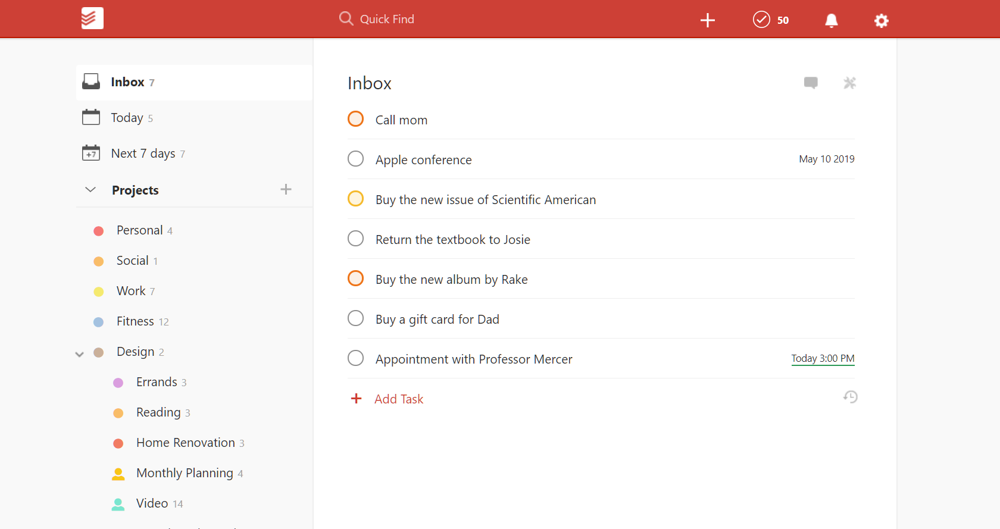

# MEVN-stack-to-do-list

A simple to-do list project using the MEVN stack.

## Context

I am currently learning MEVN stack. This project is my training on this path.

## Goal

I found this screenshot of the Todoist app (<https://todoist.com>) that will act as my specifications.



## Features

- [x] Readme
- [ ] API
  - [x] Exist
  - [x] Create to-do item
  - [x] Read to-do items list
  - [x] Update to-do item label
  - [x] Update to-do item status
  - [x] Delete to-do item
  - [ ] Reorder to-do item
  - [ ] Swagger support
- [ ] Web client
  - [ ] Exist
  - [ ] Create to-do item
  - [ ] Read to-do items list
  - [ ] Update to-do item label
  - [ ] Update to-do item status
  - [ ] Delete to-do item
  - [ ] Reorder to-do item with drag and drop
- Bonus
  - [ ] Authenticated through Auth0
  - [ ] Multi-users (with multiple to-do list)
  - [ ] Multi-to-list for each user
  - [ ] Add a date property on a a to-do item
  - [ ] Containerized on Docker
  - [ ] Search/Filter field
  - [ ] Add folders (like in the screenshot)

## Installation

Have Node.js installed (tested with v13.0.1).
Have MongoDB installed (tested with v4.2.1).

### API

```cmd
cd .\src\api\
npm install
```

## Quick start

### API

```cmd
cd .\src\api\
npm run start
```

## Quick start dev env

### API

```cmd
cd .\src\api\
npm run devStart
```

## Resources

<https://expressjs.com/>
<https://dev.to/beznet/build-a-rest-api-with-node-express-mongodb-4ho4>

### Install, setup and use Swagger

<https://www.npmjs.com/package/swagger-jsdoc>
<https://www.npmjs.com/package/swagger-ui-express>
<https://github.com/Surnet/swagger-jsdoc/blob/master/docs/GETTING-STARTED.md>
